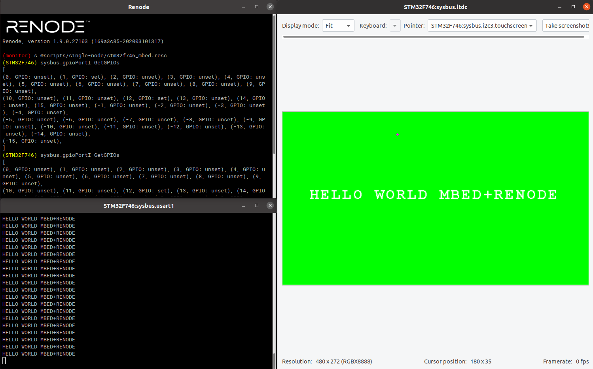

# mbed-os-renode-example
This is a mbed example project with some modifications to make it run with Renode (support for the Renode platform is done in the [following Renode fork](https://github.com/andresR8/renode) more info [here](https://github.com/renode/renode/issues/75)). 

The target is the DISCO_F746NG board.

## Prerequisites 
1. [Install Mbed CLI](https://os.mbed.com/docs/mbed-os/latest/quick-start/offline-with-mbed-cli.html)

## Building and running

Move to the root folder of the repo and run the following comands:

```bash
    $ mbed deploy
    $ sudo chmod u+x fix_mbed.py
    $ ./fix_mbed.py
    $ mbed compile --target DISCO_F746NG
```

You will find the file: ./BUILD/DISCO_F746NG/GCC_ARM/mbed-os-renode-example.elf which you can use in the [mbed file .resc]() on Renode

## Expected output

The example, runs the LTDC with a message, it also display a message over serial console, and toggles the LED1 (PORT_I_1)

<p align="center">
  
</p>


